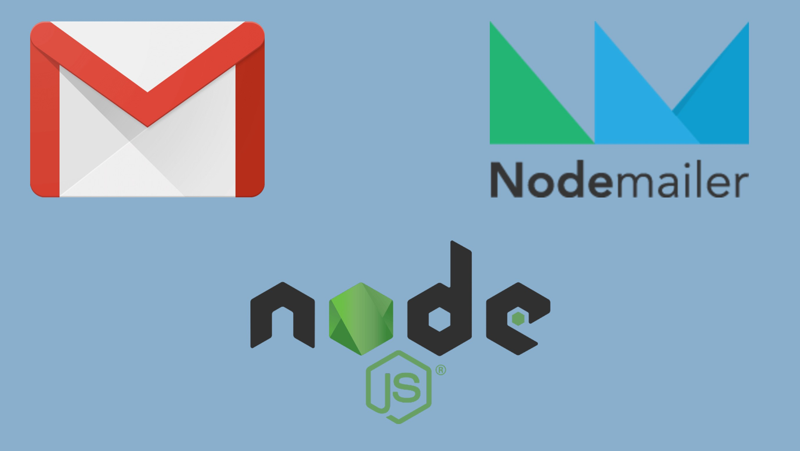

# How-to-send-emails-using-NodeMailer-gmail-and-OAuth2

The email will be sent from an API end point and will use OAuth2 credentials to send them, this is much better from a security point of view as we don’t have to store actual email credentials but instead store and use access tokens and these can only be used for certain purposes for a short amount of time.

	

## Author
> Nishkarsh01

## Clone this Repository

```bash
git clone https://github.com/Nishkarsh01/How-to-send-emails-using-NodeMailer-gmail-and-OAuth2.git
```

## Usage

#### `npm install`

#### `node server.js`

## Collaborate
To collaborate, reach me on [nishdubb11@gmail.com]()


## Further help
For more information you can checkout:

Open:
https://medium.com/@alexb72/how-to-send-emails-using-a-nodemailer-gmail-and-oauth2-fe19d66451f9
